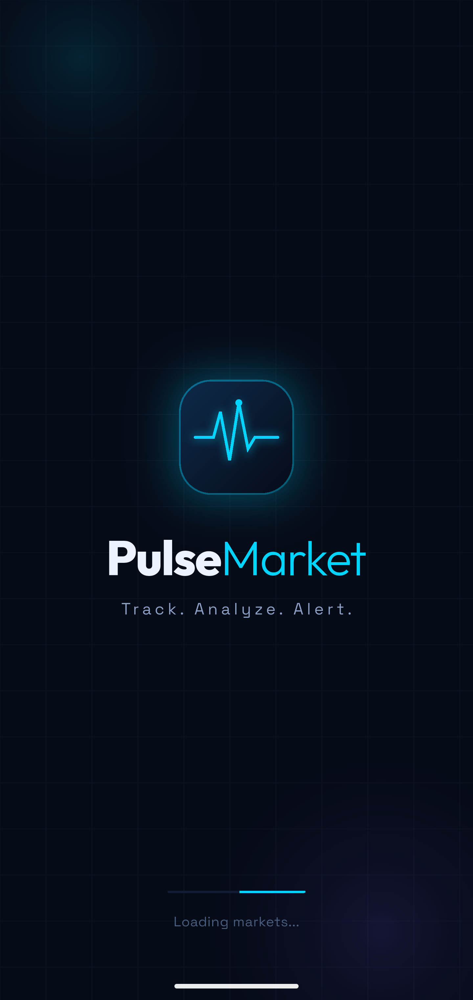
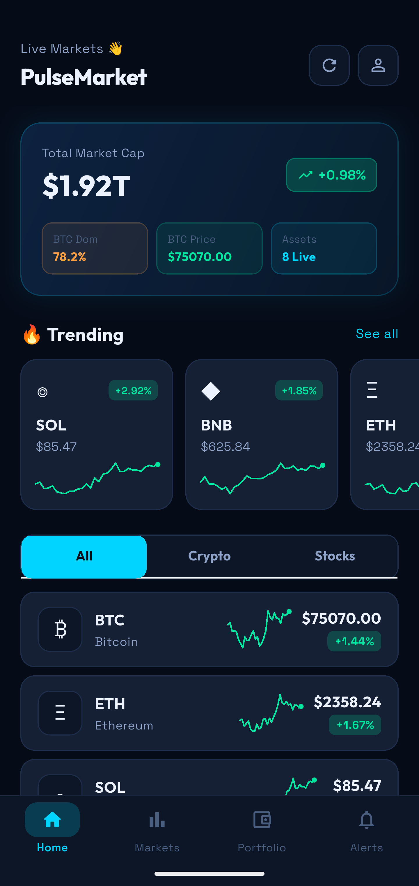
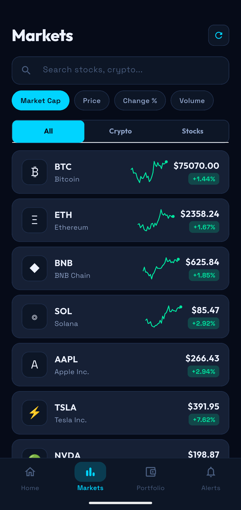
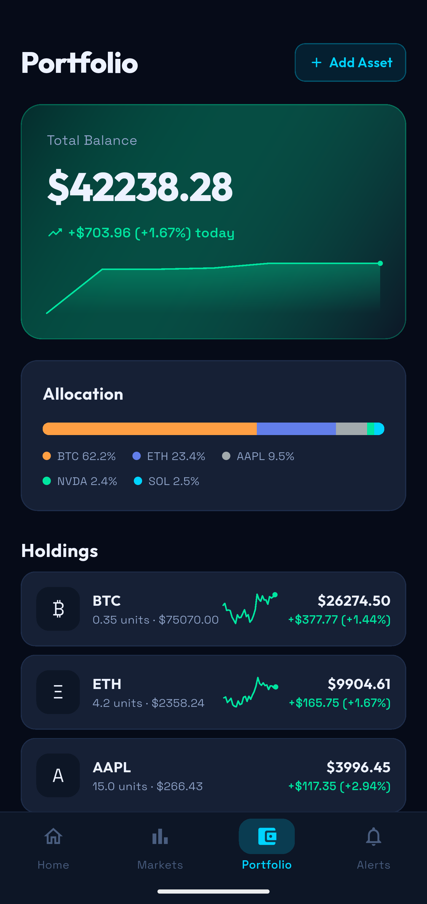
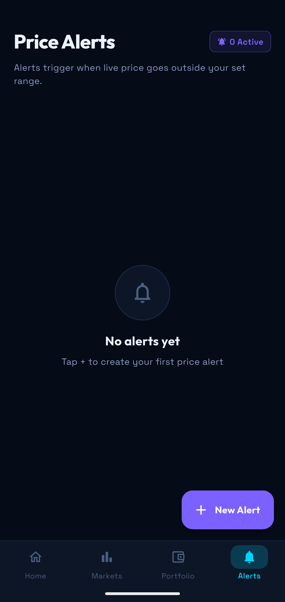

# 📈 PulseMarket — Live Stocks & Crypto Tracker

A Flutter app for real-time stock and cryptocurrency tracking with price alerts, push notifications, and background price monitoring.

---

## 📱 Screenshots

> Add screenshots here after running the app. Place them in a `screenshots/` folder and reference like:
> ```





> ```

---

## ✨ Features

- 📊 **Live Market Data** — Real-time stock and crypto prices
- 🕯️ **Candlestick Charts** — Detailed asset price charts
- 🔔 **Price Alerts** — Get notified when assets hit your target price
- 📱 **Push Notifications** — Firebase Cloud Messaging (FCM) integration
- 🔄 **Background Service** — Prices update even when the app is in background
- 💼 **Portfolio Tracking** — Track your holdings
- 🎨 **Onboarding Screen** — Smooth first-time user experience
- 🌙 **Dark Theme** — Sleek dark UI

---

## 🛠️ Tech Stack

| Layer | Technology |
|---|---|
| Framework | Flutter (Dart) |
| State Management | Provider |
| Notifications | `flutter_local_notifications` + Firebase Messaging |
| Background Tasks | `flutter_background_service` |
| Charts | `fl_chart`, `candlesticks` |
| Storage | `shared_preferences` |
| UI | `google_fonts`, `shimmer`, `lottie`, `percent_indicator` |
| Backend/Push | Firebase Core + Firebase Messaging |

---

## 🚀 Getting Started

### Prerequisites

- Flutter SDK `>=3.6.0`
- Dart SDK `>=3.6.0`
- Android Studio / Xcode
- Firebase project (for push notifications)

### Installation

```bash
# Clone the repository
git clone https://github.com/YOUR_USERNAME/pulsemarket.git
cd pulsemarket

# Install dependencies
flutter pub get

# Run the app
flutter run
```

### Firebase Setup

1. Create a Firebase project at [console.firebase.google.com](https://console.firebase.google.com)
2. Add your Android/iOS app to the project
3. Download `google-services.json` → place in `android/app/`
4. Download `GoogleService-Info.plist` → place in `ios/Runner/`
5. Update `lib/firebase_options.dart` with your config

---

## 📁 Project Structure

```
lib/
├── main.dart                    # App entry point
├── theme.dart                   # App theme & colors
├── firebase_options.dart        # Firebase configuration
├── model/
│   └── asset_model.dart         # Asset data model
├── screens/
│   ├── splash_screen.dart       # Splash / loading screen
│   ├── onboarding_screen.dart   # First-time onboarding
│   ├── main_scaffold.dart       # Bottom nav scaffold
│   ├── home_screen.dart         # Home / dashboard
│   ├── market_screen.dart       # Market overview
│   ├── assets_screen.dart       # Assets list
│   ├── asset_detail_screen.dart # Individual asset detail
│   └── portfolio_screen.dart    # Portfolio tracker
├── services/
│   ├── market_service.dart      # Market data fetching
│   ├── background_services.dart # Background price updates
│   └── notification_services.dart # FCM + local notifications
└── widgets/
    ├── asset_card.dart          # Asset list card
    ├── ticker_tape.dart         # Scrolling ticker
    ├── live_badge.dart          # Live indicator badge
    ├── sparklinr.dart           # Mini sparkline chart
    ├── price_alert_sheet.dart   # Price alert bottom sheet
    ├── debug_overlay.dart       # Debug info overlay
    └── fcm_token_debug.dart     # FCM token display widget
```

---

## 📦 Dependencies

```yaml
flutter_local_notifications: ^17.0.0
firebase_core: ^3.6.0
firebase_messaging: ^15.1.3
flutter_background_service: ^5.0.5
provider: ^6.1.1
fl_chart: ^0.66.2
candlesticks: ^2.1.0
google_fonts: ^6.1.0
shimmer: ^3.0.0
lottie: ^3.0.0
shared_preferences: ^2.2.2
http: ^1.2.0
percent_indicator: ^4.2.3
intl: ^0.19.0
```

---

## 🤝 Contributing

Pull requests are welcome! For major changes, please open an issue first.

---

## 📄 License

This project is for personal/educational use. All rights reserved.
